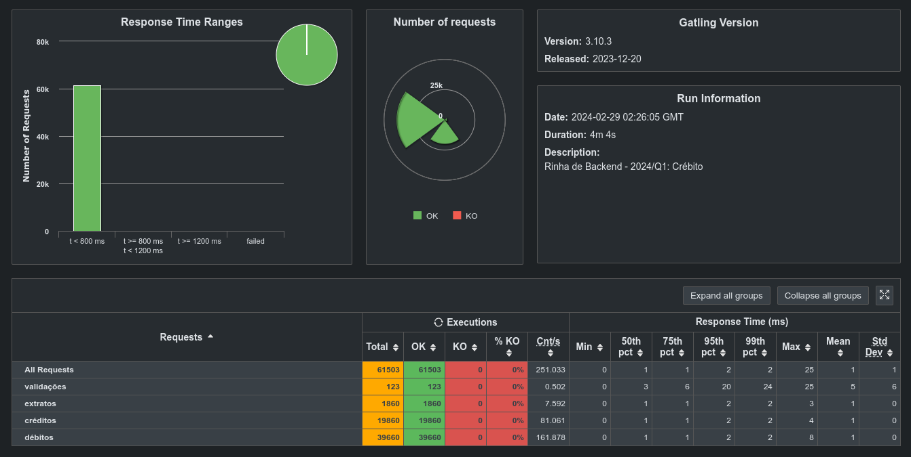

# Solução para a Rinha de Backend 2024/Q1

Implementação para resolver o desafio da [Rinha de Backend 2024/Q1](https://github.com/zanfranceschi/rinha-de-backend-2024-q1).

Link para o repositório https://github.com/hstreb/rinha-backend-2024-q1-vertx.

## Tecnologias

- linguagem java 21, usando GraalVM para gerar executável nativo.
- web framework vertx 4.5.4
- base de dados PostgreSQL 16.2
- load balancer nginx

## Construir imagem jvm

- construir a aplicação:

    ```shell
    ./gradlew build
    ```

- construir o imagem docker

    ````shell
    docker build -t hstreb/rinha-2024-q1-vertx:0.0.2 -f Dockerfile.jvm .
    ````

- publicar a imagem no docker hub

    ````shell
    docker push hstreb/rinha-2024-q1-vertx:0.0.2
    ````

## Construir imagem nativa

> Observação: foi utilizado o [trace agent](https://www.graalvm.org/latest/reference-manual/native-image/metadata/AutomaticMetadataCollection/) com execução do teste da rinha, para gerar os metadados.
> `java -agentlib:native-image-agent=config-output-dir=src/main/resources/META-INF/native-image/ -jar build/libs/rinha-2024-q1-vertx-0.0.1-fat.jar`

- construir a aplicação:

    ```shell
    ./gradlew nativeCompile
    ```

- construir o imagem docker

    ````shell
    docker build -t hstreb/rinha-2024-q1-vertx:0.0.2-native .
    ````

- publicar a imagem no docker hub

    ````shell
    docker push hstreb/rinha-2024-q1-vertx:0.0.2-native
    ````

## Rodar

- versão jvm

  ```shell
  docker compose -f compose-jvm.yml up -d
  ```

- versão nativa

  ```shell
  docker compose up -d
  ```

## Resultados

- rodando com a versão JVM
  
- rodando com a versão nativa
  
- rodando versão 0.0.2 nativa, sem usar exceptions no tratamento do limite
  

## Contatos

- https://twitter.com/humbertostreb
- https://github.com/hstreb